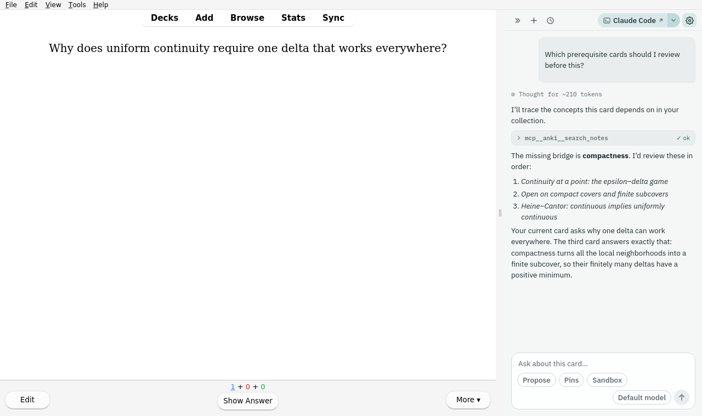
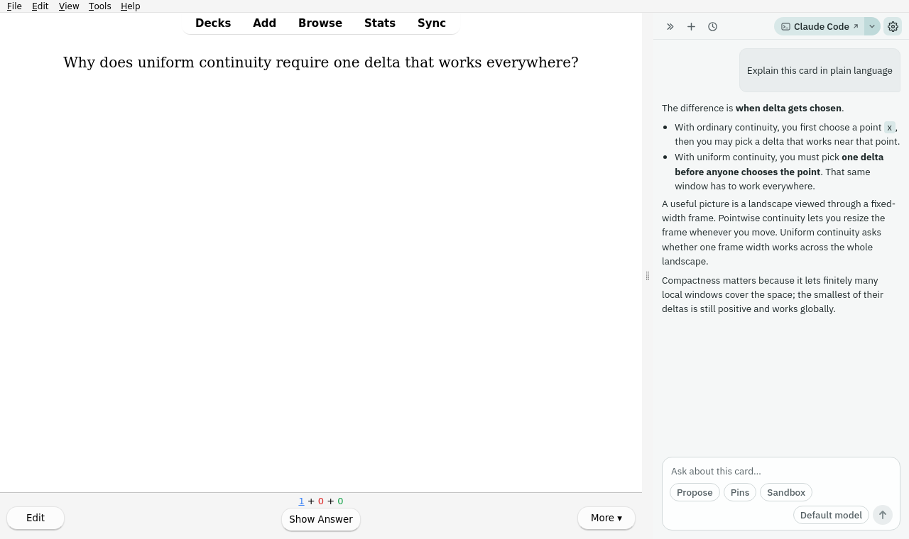
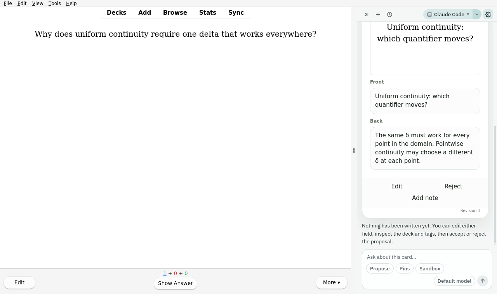

# Chat With Your Cards

An AI chat dock inside Anki, with the card you are reviewing and the structure
of your collection available as context.



[Animated tour](https://ritornello.dev/media/ankiweb/2026-07-30/chat-with-your-cards/preview.gif)
· [MP4 video](https://ritornello.dev/media/ankiweb/2026-07-30/chat-with-your-cards/demo.mp4)

Chat With Your Cards is built for questions that arise while studying: explain
this card, find related material, inspect the surrounding topic, or propose a
better note without leaving the reviewer. The agent can search the collection,
read notes and cards, summarize deck/tag structure, and prepare changes through
a reviewable proposal flow. It can also record native Anki **Again** reviews on
exact cards the learner or an AI grader identifies as wrong, even when those
cards are not scheduled today.

## Three study moments

**Understand the card in front of you.** The current reviewer card is supplied
as context, so the learner can ask the natural follow-up instead of copying the
prompt into a separate chat.



**Find the missing prerequisite.** The assistant can search the learner’s own
collection, explain the conceptual bridge, and suggest a short review path.


**Turn a confusion into a proposal.** New notes and edits remain pending until
the learner reviews the fields, deck, tags, and rationale.



The captures use a synthetic collection created inside a disposable Anki
profile. See the [user stories](docs/USER_STORIES.md) for the scenarios and
their product intent.

## Status

**Active developer preview.** The core chat, collection tools, note proposals,
safe application/revert path, and real-Anki GUI tests are working. It is not yet
published on AnkiWeb, and configuration still assumes a technically comfortable
user.

The first backend uses a locally installed CLI agent through a loopback MCP
server. Claude Code is implemented; a Codex adapter and a direct BYOK API
backend are planned. See [DESIGN.md](DESIGN.md) for the current architecture and
milestones.

## What it can do

- Keep the current reviewer card prominently in context.
- Search with Anki syntax and inspect notes, cards, decks, tags, and study
  statistics.
- Build a cached, annotated map of the collection without stuffing the entire
  collection into every prompt.
- Fetch card images as actual visual inputs rather than passing filenames.
- Propose new notes and edits with deck, tag, note-type, and field constraints.
- Render the note's real card templates before a proposed change is accepted.
- Show per-field diffs, detect stale edits, and support per-change or
  whole-session rollback.
- Fail exact future, suspended, buried, and filtered-deck cards through Anki's
  native scheduler, with a dedicated confirmation/audit chip.
- Search with native Anki syntax at card level without collapsing a matching
  sibling to its note; results include template, deck, hidden, flag, and
  scheduling context for safe exact-ID selection.
- Preserve existing hidden state, report it explicitly, and offer a separate
  “Make available” action that leaves the recorded failure intact.
- Carry neutral Agent Skills for card authoring, curriculum design, safe
  delivery, and user-owned conventions learned from accepted edits.
- Render Mermaid diagrams and opt-in interactive widgets in a restricted
  sandbox.

## Safety model

Content and deck writes pass through the proposal manager, which validates the
operation, displays the change, and applies only what the user accepts.
Scheduler grading passes through a separate, narrow grading manager backed by a
pinned vendored copy of
[Safe Collection Operations](https://github.com/ritornello-labs/anki-addon-safe-collection-operations).
It uses Anki's native Grade Now/scheduler operations, exact card IDs, stable
note GUID preflight, transactions, postconditions, and idempotent event
cursors—never direct scheduling-row writes.

In Propose and Ask-each-read modes, grading waits on its dedicated confirmation
chip. Auto-accept and Trusted writes may apply it immediately under their
existing session caps; Read-only blocks it. Existing suspension and both forms
of burial remain after the failure and are visibly offered for removal.
Destructive content actions still create a backup checkpoint first.

Card content is treated as untrusted input. The local MCP server binds to a
random loopback port and requires a per-session token; inheritance of unrelated
user MCP servers is off by default. Sandboxed widgets have an opaque origin, a
no-network content-security policy, and no access to the add-on or collection.

Read [SAFETY.md](SAFETY.md) for the threat model and [COMPLIANCE.md](COMPLIANCE.md)
for the distribution and provider-boundary review.

## Development

The add-on itself is pure Python and ships without an npm build step. The
React/assistant-ui source under `ui/` is compiled into the checked-in web bundle
used by Anki.

```bash
# Lint, type-check, and run unit tests without Anki
make check

# Run the real add-on in disposable Anki under Docker/Xvfb
make test-gui-smoke-docker

# Fast frontend iteration against the scripted replayer
cd ui && npm run dev
```

The GUI smoke test uses
[`anki-addon-workbench`](https://github.com/ritornello-labs/anki-addon-workbench) to
install the add-on into a disposable profile, drive the real send and proposal
paths, manipulate real test notes, and capture light/dark screenshots. It never
opens or changes the user's normal Anki profile.

To recreate all three public user-story captures after the complete smoke
suite:

```bash
CWYC_PUBLIC_SCREENSHOT=1 uv run --group dev \
  anki-workbench smoke --timeout 120 \
  --screenshot docs/images/chat-with-your-cards.png
```

See [tests/gui_smoke/README.md](tests/gui_smoke/README.md) for platform details.

## Repository map

| Path | Purpose |
| --- | --- |
| `chat_with_your_cards/` | Add-on, bridge, tools, proposals, and bundled UI |
| `ui/` | React/assistant-ui source and scripted development replayer |
| `tests/` | Unit, contract, and disposable-Anki GUI tests |
| `DESIGN.md` | Architecture, decisions, milestones, and known issues |
| `SAFETY.md` | Threat model and write-safety invariants |
| `COMPLIANCE.md` | Distribution and backend compliance review |

The future `.ankiaddon` artifact is the `chat_with_your_cards/` directory
packaged for Anki.

## License

MIT. See [LICENSE](LICENSE).
